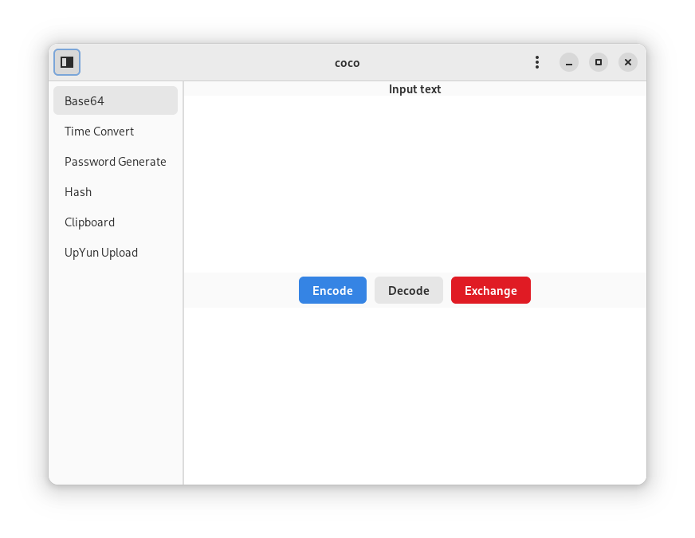
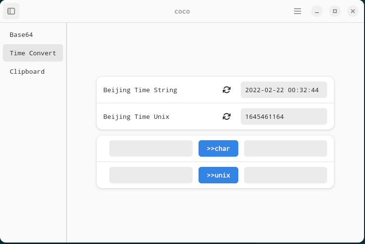
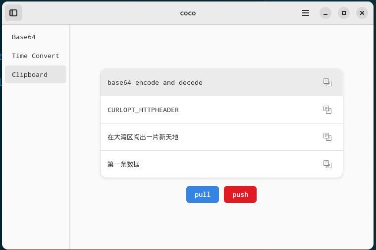

# Coco

A Developer Tool Building by GTK4(meson+gtk4+Adwaita).

## License

Coco is licensed under the MIT.

## Functions

- [x] base64 encode and decode
- [x] time convert
- [x] clipboard
- [ ] text hash and file hash
- [x] password generate

## Usage

install gnome-nightly flatpakrepo.

```sh
# gnome-nightly include org.gnome.Platform/x86_64/master
flatpak remote-add --if-not-exists gnome-nightly https://nightly.gnome.org/gnome-nightly.flatpakrepo
# need master or gnome platform 42 environment.
flatpak install org.gnome.Platform/x86_64/master
flatpak install org.gnome.Sdk/x86_64/master
```

### build

install flatpak-builder

```sh
sudo dnf install flatpak-builder -y
```

install cc.xuthus.coco

```sh
git clone https://github.com/xuthus5/coco.git
cd coco
flatpak-builder --user --install --force-clean build-flatpak/ cc.xuthus.coco.json
```

run cc.xuthus.coco

```sh
flatpak run cc.xuthus.coco
```

## screenshot







